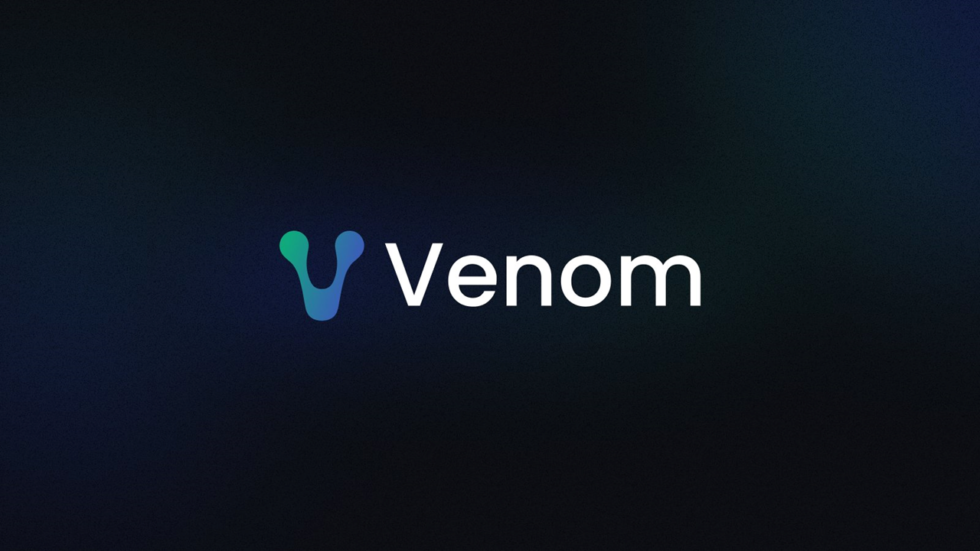

# venom-auto

Venom Network auto using selenium framework
The script will automation almost task on [venom network tasks](https://venom.network/tasks):
- [x] [Stake Venom](https://venom.network/tasks/venom-stake)
- [x] [Venom Wallet](https://venom.network/tasks/venom-wallet)
- [x] [Web3 World](https://venom.network/tasks/web3-world)
- [x] [Venom Pad](https://venom.network/tasks/venom-pad)
- [x] [NFT Oasis_Gallery](https://venom.network/tasks/oasis-gallery)
- [ ] [Venom Bridge](https://venom.network/tasks/venom-bridge)
- [ ] [Venom Pools](https://venom.network/tasks/venom-pools)

## Install package
```sh
pip3 install -r requirements.txt
```
or using pipenv
```sh
pipenv sync
```

## Create wallet

```bash
cp .env-example .env
cp account.example.csv account.venom.csv
python3 wallet/venom/__init__.py
```

## Run app auto
    
```bash
python3 app/venom_stake.py
```


## Contact

[](https://t.me/bxdoan)
[](https://twitter.com/bxdoan)
[](mailto:hi@bxdoan.com)

## Thanks for use
Buy me a coffee

[](https://www.buymeacoffee.com/bxdoan)
[](https://etherscan.io/address/0x610322AeF748238C52E920a15Dd9A8845C9c0318)
[](https://paypal.me/bxdoan)
